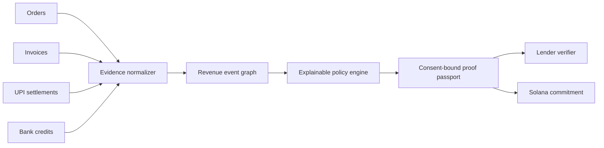

# PayProof

[](https://github.com/SNAKBILLION/payproof-solana-prototype/actions/workflows/deploy-pages.yml)
[](LICENSE)
[](https://explorer.solana.com/tx/2ieUAnQb5ydKo9VyACzgXuAncfbB4Dbo4ciJBbs1HMXX2fGqQW66xQY82yK3hAFf7i9jhQEHBiZqRbvSuPy1CiPN?cluster=devnet)

**Invisible commerce, verified.**

PayProof turns fragmented orders, invoices, UPI settlements and bank credits into
explainable, privacy-safe evidence for working-capital review.

## Why this exists

Small merchants often have real commerce but weak documentation. Their activity
lives across WhatsApp orders, invoice files, payment apps and bank credits.
PayProof reconciles those records into revenue events without creating a generic
credit score or giving a lender access to the merchant's raw financial history.

## Working product

- Import CSV or JSON records from four evidence sources.
- Normalize and reconcile records into cross-source revenue events.
- Preserve the provenance chain and confidence for every event.
- Run a replayable lender policy with explicit pass/fail reasons.
- Generate a purpose-bound proof passport with merchant-controlled disclosure.
- Hash source evidence into a Merkle root and SHA-256 credential commitment.
- Show a verifier only the allowed claims, never the raw source records.
- Connect Phantom or Solflare and anchor the commitment through Solana Memo on devnet.
- Verify the finalized receipt, issuer signer, commitment and consent expiry independently.

## Verified proof of work

- Live product: https://snakbillion.github.io/payproof-solana-prototype/
- Finalized Solana devnet receipt:
  https://explorer.solana.com/tx/2ieUAnQb5ydKo9VyACzgXuAncfbB4Dbo4ciJBbs1HMXX2fGqQW66xQY82yK3hAFf7i9jhQEHBiZqRbvSuPy1CiPN?cluster=devnet
- Sample evidence bundle:
  https://snakbillion.github.io/payproof-solana-prototype/samples/payproof-pilot-evidence.zip
- Narrated product demo (under 90 seconds):
  https://snakbillion.github.io/payproof-solana-prototype/downloads/PayProof-90s-Demo.mp4
- Six-slide grant deck:
  https://snakbillion.github.io/payproof-solana-prototype/downloads/PayProof-Grant-Deck.pptx
- Funding applications: [APPLICATION_PACK.md](APPLICATION_PACK.md)
- Demo narration: [artifacts/DEMO_SCRIPT.md](artifacts/DEMO_SCRIPT.md)

## Product flow

1. Load the pilot case or import local CSV/JSON evidence.
2. Review verified, supported and unmatched commerce events.
3. Run the working-capital second-look policy.
4. Choose claims and consent expiry.
5. Generate the private commitment.
6. Optionally connect a Solana wallet and anchor the commitment on devnet.
7. Share the proof URL and verify it independently in the lender view.

## Local development

```bash
pnpm install
pnpm dev
```

Production checks:

```bash
pnpm build
pnpm test
pnpm lint
```

## Import schema

PayProof accepts flexible CSV/JSON field names. A canonical row looks like:

```json
{
  "id": "ORD-1042",
  "source": "order",
  "timestamp": "2026-06-28T10:30:00.000Z",
  "amount": 12600,
  "counterparty": "Field Office Co",
  "reference": "FO-126"
}
```

Valid source values are `order`, `invoice`, `bank` and `settlement`. Imported
files are processed in the browser and are not uploaded by the current product.

## Verification protocol

The canonical source lives on the `source-v4` branch. Every push is linted, tested,
built, deployed and smoke-tested through GitHub Actions.

PayProof proof packages are schema-validated before use. New receipts write a compact
`PP3` envelope to Solana Memo containing only the credential commitment, evidence
root and expiry. The verifier:

- recomputes the credential commitment from the displayed claims;
- requires the issuer wallet to be a signer on the transaction;
- checks every Memo instruction for an exact proof match;
- requires a finalized Solana transaction;
- binds the chain block time to the credential issue time;
- enforces the consent expiry at verification time; and
- remains compatible with previously issued full v3 receipts.

## Architecture



## Trust boundaries

PayProof is not a lender, bureau score or automatic approval engine. It creates
decision evidence for human review. Raw evidence remains off-chain; only a
credential commitment and minimal proof metadata are written to Solana.

## Current scope

This repository is a working technical pilot with a real finalized Solana devnet
transaction and independent verification path. It is not yet a production lending
system. Production rollout still requires authenticated case storage, audited source
adapters, managed issuer keys, revocation/status infrastructure, lender organization
controls, monitoring and repayment outcome attestations.

Released under the [MIT License](LICENSE).
